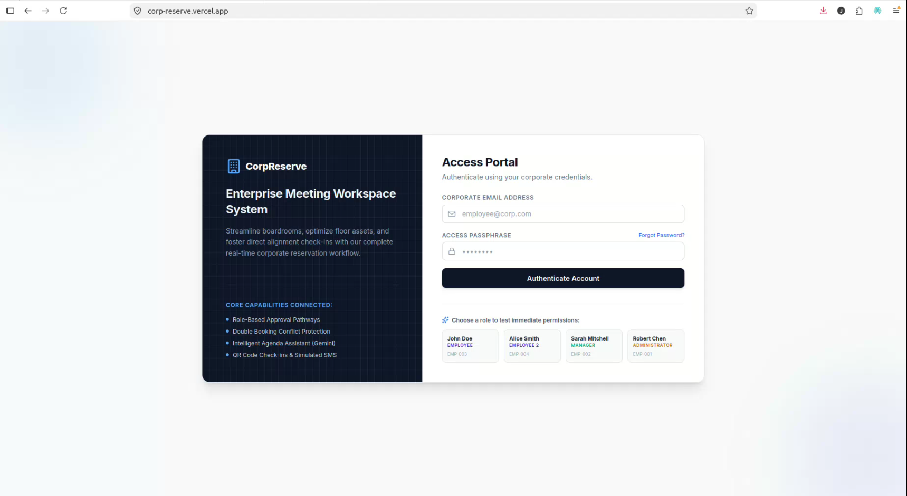
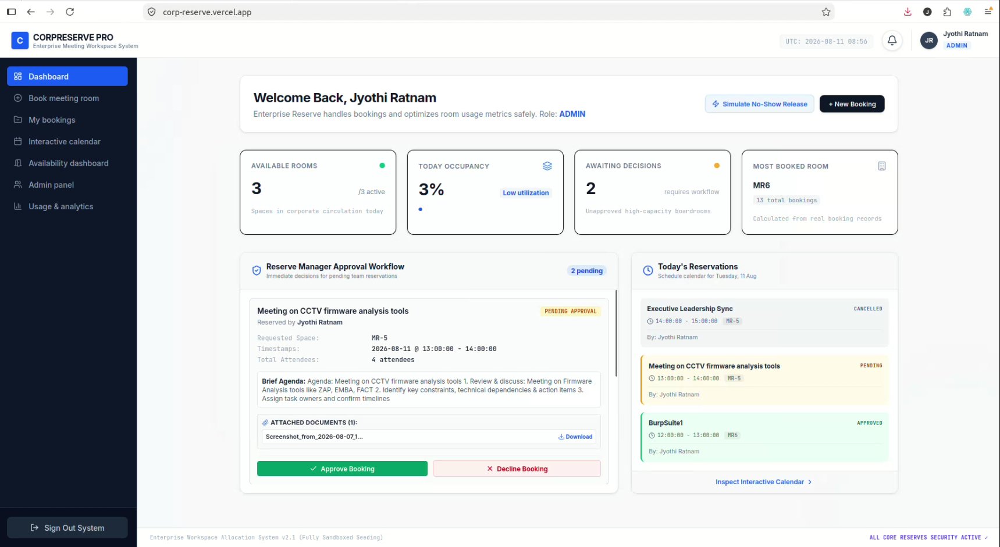
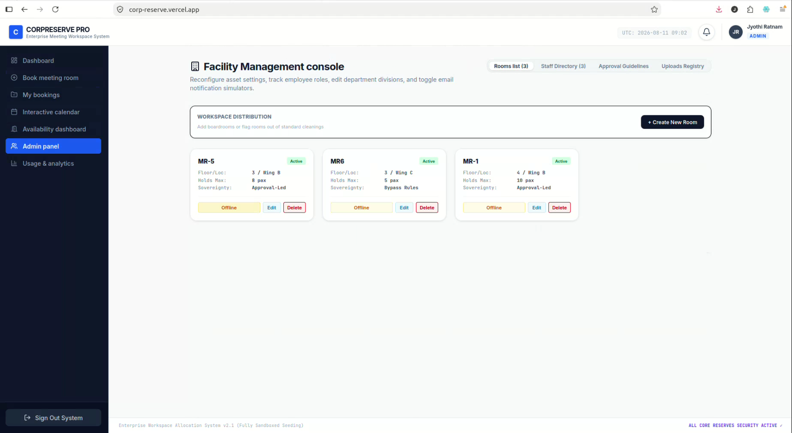
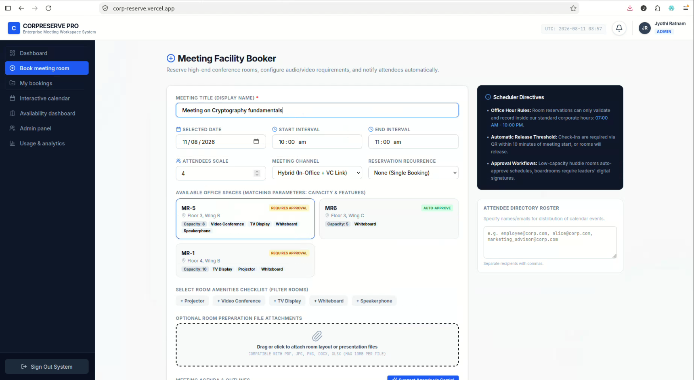
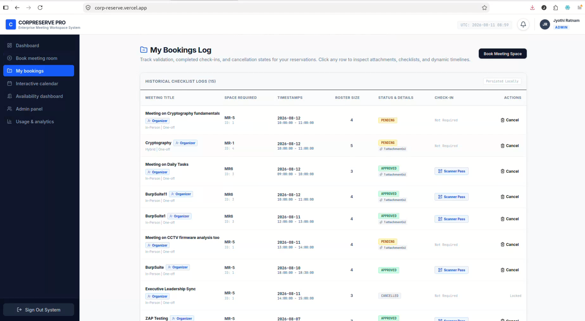

# Meeting Room Booking System

A modern full-stack web application designed to simplify meeting room discovery, availability management, and room reservations for organizations.

> **Meeting Room Booking System** — A full-stack application for managing meeting rooms, availability, reservations, and booking workflows.
---

## 🚀 Live Demo

**Try the application:**  
[Open Live Demo](https://corp-reserve.vercel.app/)

> The live environment is provided for demonstration purposes.

## 🎥 Product Demo

Watch the complete application walkthrough:


[▶️ Watch the Demo Video](./corp-reserve-demo.mp4)


The demo covers authentication, room availability, booking, booking management, and other key workflows.

---

## 📌 Project Overview

Organizations often manage meeting rooms through manual coordination, spreadsheets, emails, or messaging platforms. This can result in double bookings, difficulty checking availability, poor visibility of schedules, and unnecessary coordination.

The **Meeting Room Booking System** provides a centralized web platform where users can:

- Check meeting room availability
- Select a suitable room and time slot
- Create and manage reservations
- View their bookings
- Cancel reservations
- Access booking information
- Use QR-code-based booking information
- Attach relevant documents where required

The goal is to make meeting-room management simpler, faster, and more organized.

---

## ✨ Key Features

### 👤 User Authentication
- User login
- Authentication-based application access
- User-specific booking information
- Role-based functionality

### 🏢 Meeting Room Management
- View available meeting rooms
- View room information
- Manage room availability
- Support for multiple meeting rooms

### 📅 Meeting Booking
- Select meeting room
- Select date
- Select start and end time
- Add meeting details
- Create reservations
- Validate booking conflicts

### 📋 My Bookings
Users can:
- View their bookings
- Review booking details
- Track upcoming meetings
- Cancel existing bookings

### 📱 QR Code Support
Booking information can be represented using QR codes for convenient access and sharing.

### 📎 Attachment Support
Relevant files/documents can be attached to bookings where required.

### 🛡️ Administrative Management
Authorized users can manage meeting rooms and relevant system data.

### 📱 Responsive Interface
The application is designed to provide a consistent experience across desktop and modern mobile browsers.

---

## 🖥️ Application Screens

### Login



### Dashboard



### Meeting Rooms



### Create Booking



### My Bookings



> Add your actual screenshots to the `screenshots/` directory and update filenames if required.

---

## 🏗️ System Architecture

```text
                    ┌──────────────────────┐
                    │       End User       │
                    │     Web Browser      │
                    └──────────┬───────────┘
                               │
                               ▼
                    ┌──────────────────────┐
                    │       Vercel         │
                    │    React Frontend    │
                    └──────────┬───────────┘
                               │
                         REST API / HTTPS
                               │
                               ▼
                    ┌──────────────────────┐
                    │       Render         │
                    │   Spring Boot API    │
                    └──────────┬───────────┘
                               │
                         JDBC / SQL
                               │
                               ▼
                    ┌──────────────────────┐
                    │       Aiven          │
                    │      MySQL DB        │
                    └──────────────────────┘
```

---

## 🛠️ Technology Stack

| Layer | Technology |
|---|---|
| Frontend | React |
| Backend | Java, Spring Boot |
| API | REST APIs |
| Database | MySQL |
| Frontend Hosting | Vercel |
| Backend Hosting | Render |
| Database Hosting | Aiven |
| Version Control | GitHub |
| Communication | HTTPS / REST |

---

## 🔄 Application Workflow

```text
User Login
    │
    ▼
Dashboard
    │
    ▼
View Meeting Rooms
    │
    ▼
Check Availability
    │
    ▼
Select Date & Time
    │
    ▼
Create Booking
    │
    ▼
Booking Confirmation
    │
    ▼
My Bookings
    │
    ├───────────────┐
    ▼               ▼
View Details    Cancel Booking
```

---

## 🎯 Business Value

### Reduced Manual Coordination
Employees can independently check availability and reserve rooms without relying on manual communication.

### Improved Booking Accuracy
Availability validation helps prevent conflicting room reservations.

### Centralized Information
Meeting room schedules and booking information are maintained in one centralized application.

### Improved Productivity
Users spend less time coordinating rooms and more time focusing on their work.

### Better Visibility
Employees can easily view and manage their upcoming and previous reservations.

---

## 👨‍💻 My Role & Contribution

I was responsible for the **design, development, integration, testing, and deployment** of the application.

Key contributions included:

- Designing the application workflow
- Developing the React frontend
- Developing Spring Boot REST APIs
- Implementing room availability and booking logic
- Designing database interactions
- Implementing authentication-related functionality
- Developing room and booking management features
- Integrating frontend and backend services
- Implementing QR-code functionality
- Implementing attachment handling
- Testing application workflows
- Configuring deployment environments
- Deploying frontend, backend, and database services
- Troubleshooting integration and deployment issues

---

## ☁️ Deployment Architecture

The application uses separate services for frontend, backend, and database hosting.

```text
                    GitHub
                       │
              ┌────────┴────────┐
              ▼                 ▼
           Vercel             Render
              │                 │
              ▼                 ▼
        React Frontend     Spring Boot API
                                │
                                ▼
                              Aiven
                                │
                                ▼
                              MySQL
```

This separation allows each application layer to be independently maintained and deployed.

---

## 🔐 Source Code

The production source code is maintained in a **private repository**.

This public repository is intentionally provided as a **portfolio showcase** containing:

- Project documentation
- Screenshots
- Demo video
- Architecture
- Technology information
- Live application link

The application's proprietary source code is not publicly distributed.

---

## 🧪 Demo Environment

The live application is provided for demonstration purposes.

The environment may contain:

- Sample users
- Sample meeting rooms
- Demo bookings
- Non-production data

**Please do not enter confidential or personal information into the demo application.**

---

## 📈 Future Enhancements

Potential improvements include:

- Email notifications
- Google Calendar / Microsoft Outlook integration
- Recurring meetings
- Room capacity management
- Equipment/resource management
- Advanced administration dashboard
- Analytics and reporting
- Mobile application
- Advanced notification system
- Automated demo-data reset

---

## 💼 Custom Web Application Development

This project demonstrates the ability to design and develop customized, database-driven business applications.

Similar solutions can be adapted for:

- Corporate offices
- IT companies
- Educational institutions
- Government organizations
- Co-working spaces
- Training centers
- Conference facilities
- Internal enterprise applications

I also develop custom:

- Business management systems
- Booking and reservation systems
- Employee management systems
- Internal enterprise portals
- Dashboard applications
- Workflow management systems
- REST API-based applications
- Database-driven web applications

**Interested in discussing a project?**

[Contact Me](YOUR_PORTFOLIO_OR_CONTACT_URL)

---

## ⭐ Project Highlights

- Full-stack web application
- React frontend
- Java Spring Boot backend
- REST API architecture
- MySQL database
- Authentication
- Meeting room availability management
- Booking management
- QR code integration
- File attachment support
- Cloud deployment
- Responsive web interface
- Production-style architecture

---

## 📄 License

This repository is a **portfolio showcase** and does not contain the application's proprietary source code.

© 2026 Jyothi. All rights reserved.
